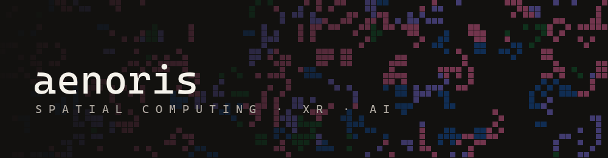

<picture>
  <source media="(prefers-color-scheme: dark)" srcset="assets/banner-dark.gif">
  <source media="(prefers-color-scheme: light)" srcset="assets/banner-light.gif">
  
</picture>

# Joaquín Quiroga

`Spatial Computing Engineer` · AI/ML pipelines for 3D reconstruction · XR · brain-computer interfaces

I build immersive XR and AI experiences, from ideas to reality. I own the reconstruction pipeline end to end, from image pre-processing through model training to on-device optimization for XR headsets. I am especially into brain-computer interfaces and Human-Human-Computer Interaction, which is why I am doing an MSc in Neuroscience at UBA, to build a deeper foundation in how the brain actually works.

```text
> whoami
Joaquín Quiroga · @aenoris · Buenos Aires, Argentina
Sr. Software Engineer · 1y+ ML/AI for spatial computing · 6y+ full-stack & mobile for startups
focus  · brain-computer interfaces, Human-Human-Computer Interaction
status · MSc Neuroscience (UBA), in progress
```

[](https://aenoris.xyz)
[](https://www.linkedin.com/in/joaqu%C3%ADn-quiroga-20731b96/)


| Project | What it is |
|---|---|
| **[taXR](https://github.com/aenoriss/taXR)**<br>`FAISS · k-mer · Python` | Point-and-classify for DNA barcodes. A FAISS index over k-mer vectors, with a bootstrap confidence score you can trust. |
| **[Marlowe](https://github.com/aenoriss/Marlowe)**<br>`Unity · Quest 3 · MQTT · ESP32` | A Meta Quest 3 that runs the message broker itself and drives real electronics over your own WiFi. |
| **[merlin](https://github.com/aenoriss/merlin)**<br>`RAG · Modal · Next.js` | An AI study assistant that only knows your course's documents. Retrieval with TF-IDF key terms and rank fusion. |
| **[metatokens](https://github.com/aenoriss/metatokens)**<br>`WebXR · shaders · three.js` | Live crypto markets as a swarm of particle tokens you walk around in mixed reality. |
| **[kai](https://github.com/aenoriss/kai-tasks)**<br>`OpenAI Realtime · WebSocket` | Talk to your to-do list. A voice-first task manager over the OpenAI Realtime API. |
| **[Dloot](https://github.com/aenoriss/dloot_final)**<br>`AR · blockchain · AES-GCM` | Scan a code, collect the loot. Encrypted, on-chain claims from a printed marker. |


- **Sr. Software Engineer** · spatial computing — 1y+ building ML/AI pipelines for 3D reconstruction, from image pre-processing to on-device optimization for XR headsets.
- **Full-Stack & Mobile Engineer** · startups — 6y+ shipping products end to end for early-stage teams.


- **MSc Neuroscience** · UBA, ongoing — toward practical brain-computer interfaces.
- **BSc Product Design, Interactive Media** · UdeSA — Magna Cum Laude, Best Thesis Award.
- **Plataforma5** (full-stack) · **XRBootcamp** (XR, graduated with honors).


**Spatial / XR**


**AI / ML**


**Product**


<br>

<sub>ʕ•ᴥ•ʔ  vibing to Serial Experiments Lain, .hack//SIGN, Ergo Proxy and Psycho-Pass.</sub>
